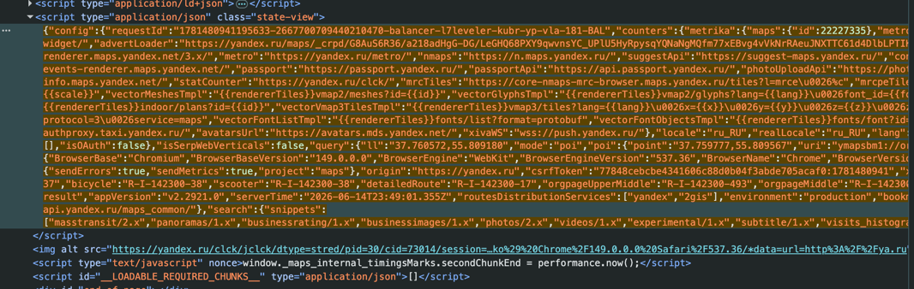
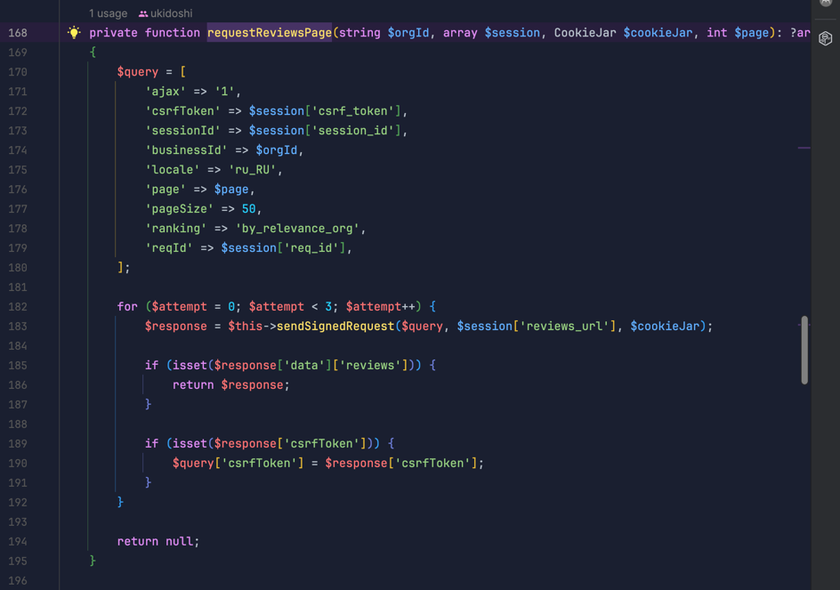

# Yndx Review

Скелет: **Laravel API + Vue 3 SPA** с входом через Sanctum.

Рабочий стенд: https://test.ukidoshi.store/

## Стек

- Laravel 13 + Sanctum (cookie-based SPA auth)
- Vue 3, Composition API, Vue Router, Bootstrap 5
- SQLite

## Локальная разработка (Docker)

```shell
docker compose up -d --build
cd backend
composer install
cp .env.example .env
php artisan key:generate
touch database/database.sqlite
php artisan migrate --seed
```

- SPA: http://localhost:5173
- API: http://localhost:8000/api

## Демо-пользователь

| Email | Пароль |
|-------|--------|
| demo@example.com | password |

## Как происходит парсинг

Яндекс Карты кидает запрос на `https://yandex.ru/maps/api/business/fetchReviews` 
и принимает id организации, csrfToken, reqId, sessionId и тд.

Закинул разметку рандомной организации у Яндекс Карт Claude. 
И он нашел большой JSON который хранит состояние страницы для SPA приложения Яндекс Карт.



В этом теге с JSON можно получить данные для запросов к их внутреннему API:
csrfToken, sessionId, requestId и другие метаданные: название, рейтинг, число оценок и отзывов.

Благодаря этому можно не парсить всю разметку, а кинуть запрос для получения отзывов туда, куда кидает бразуер в Яндекс Картах:

Берем те же параметры, что у фронтенда: businessId, page, pageSize, csrfToken, sessionId, reqId и т.д.

И отдельно нужно прописать параметр `s` - подпись query-string. Алгоритм воспроизведён:

 - ключи сортируются по алфавиту;
 - строка собирается в формате key=value&...;
 - считается hash (djb2 xor, seed 5381) — тот же, что в клиентском JS.

Запросы идут с cookie, Referer, Origin, User-Agent — как у обычного браузера.
Первый ответ часто возвращает только новый CSRF, поэтому делаем повтор (до 3 попыток).
Листаем страницы по 50 отзывов, максимум ~700 (ограничение API яндекса).


